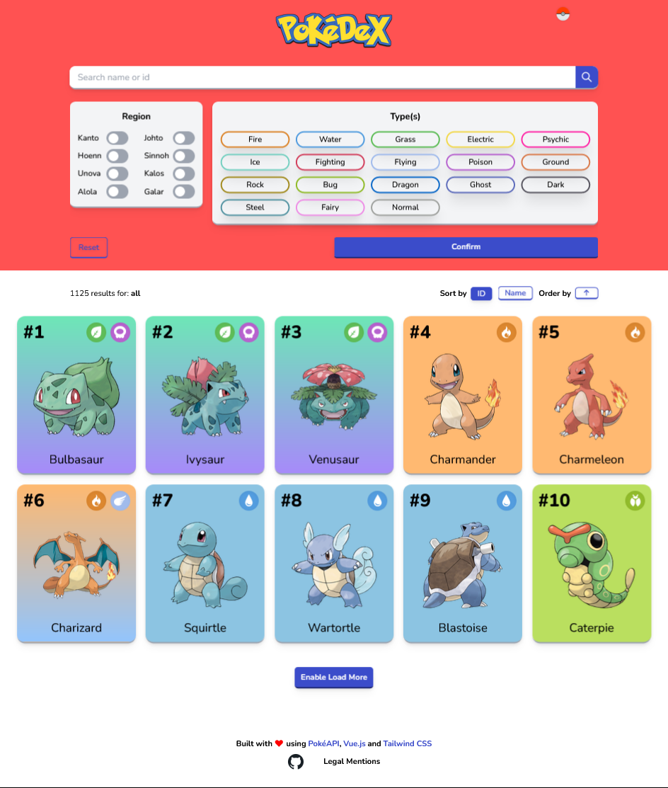

<div id="top"></div>

<!-- PROJECT LOGO -->
<h1 align="center">
  <a href="https://github.com/VichithLy/pokedex-vue-tailwindcss">
    
  </a>
</h1>

<div align="center">

[](https://github.com/VichithLy/pokedex-vue-tailwindcss/blob/master/LICENSE) [](https://app.netlify.com/sites/pokedex-vue-vlyjm/deploys)

  <p align="center">
    A simple online Pokédex using PokéAPI.
    <br/>
    <br />
    <a href="https://pokedex-vue-vlyjm.netlify.app/">View Demo</a>
  
  </p>
  </p>
</div>

<div align="center">
  <a href="https://github.com/othneildrew/Best-README-Template">
      
  </a>
</div>

<br/>
<!-- TABLE OF CONTENTS -->
<details>
  <summary>Table of Contents</summary>
  <ol>
    <li>
      <a href="#getting-started">Getting Started</a>
      <ul>
        <li><a href="#built-with">Built With</a></li>
        <li><a href="#prerequisites">Prerequisites</a></li>
        <li><a href="#installation">Installation</a></li>
      </ul>
    </li>
    <li><a href="#style-guide">Style Guide</a></li>
    <li><a href="#features">Features</a></li>
    <li><a href="#folder-structure">Folder Structure</a></li>
    <li><a href="#improvments-features-to-add">Improvments / Features to add</a></li>
    <li><a href="#license">License</a></li>
    <li><a href="#authors-and-contact">Authors and Contact</a></li>
    <li><a href="#acknowledgments">Acknowledgments</a></li>
  </ol>
</details>

# Getting Started

## Built With

- [Vue](https://vuejs.org/) (dev version [3.0.0](https://github.com/vuejs/core/blob/main/CHANGELOG.md#300-2020-09-18) and project created with [Vue CLI](https://cli.vuejs.org/) [4.5.12](https://www.npmjs.com/package/@vue/cli/v/4.5.12))
- [Tailwind CSS](https://v2.tailwindcss.com/) (dev version [2.2.17](https://tailwindcss.com/blog/tailwindcss-2-2))
- [PokéAPI](https://pokeapi.co/)

<p align="right">(<a href="#top">back to top</a>)</p>

## Prerequisites

- [Yarn](https://classic.yarnpkg.com/en/) (dev version [1.22.17](https://github.com/yarnpkg/yarn/releases/tag/v1.22.17))

Install the latest version of npm, on the command line, run the following command:

```shell
> npm install -g npm
```

Once you have npm installed you can run the following both to install and upgrade Yarn:

```shell
> npm install --global yarn
```

- [Node.js](https://nodejs.org/en/) (dev version [16.13.2](https://nodejs.org/dist/v16.13.2/docs/api/))

<p align="right">(<a href="#top">back to top</a>)</p>

## Installation

Follow the steps below to get started with this project's development environment.

1. Clone this repository and navigate into it.

```shell
> git clone https://github.com/VichithLy/pokedex-vue-tailwindcss
> cd pokedex-vue-tailwindcss/
```

2. Install the project's dependencies.

```shell
> yarn install
```

3. Start the development environment.

```shell
> yarn serve
```

4. You should see the following after `yarn serve`

```shell
  App running at:
  - Local:   http://localhost:8080/
  - Network: http://xxx.xxx.x.x:8080/
```

Open the link in your browser. You're now ready to develop!

If you want to compile and minify the project for production, use

```shell
> yarn build
```

To lint and fix files, use

```shell
> yarn lint
```

<p align="right">(<a href="#top">back to top</a>)</p>

# Style Guide

- [ESLint](https://eslint.org/): recommended rules
- [Vue Style Guide](https://v2.vuejs.org/v2/style-guide/?redirect=true#Priority-C-Recommended): recommended rules
- [Prettier](https://prettier.io/): code formatter

<p align="right">(<a href="#top">back to top</a>)</p>

# Features

- Get all Pokémon from the API
- Search Pokémon by Name or ID
- Sort Pokémon by
  - Region (only 1)
  - Type (maximum 2)
  - Name (ascending and descending)
  - ID (ascending and descending)
- Get some basic information about a Pokémon
  - Name
  - Number (or ID)
  - Types
  - Base stats
  - Small description
  - Measurements (height and weight)
  - Evolution chain
  - Main abilities
- Reset form
- Search bar with autocomplete search suggestions
- Display simple and detailed cards of Pokémon
- Infinite scroll (Load more Pokémon)
- Loading skeletons (on first landing Home page and when a Pokémon is loading)

<p align="right">(<a href="#top">back to top</a>)</p>

# Folder Structure

```bash
.
├── ...
├── src
│ ├── assets # Images, icons and style files
│ ├── components # Vue Components
│ ├── composables # Composable functions (for Vue Composition API)
│ ├── constants # Mostly enumerations (types, regions, etc.)
│ ├── data # Static JSON data (regions, types, Pokémon)
│ ├── router # Vue router configuration
│ ├── services # PokéAPI requests
│ ├── store # Vuex configuration
│ ├── utils # Useful functions
│ └── views # Main pages of the app
└── ...
```

<p align="right">(<a href="#top">back to top</a>)</p>

# Improvements / Features to add

- More details on Pokémon
- Dark Mode
- Progressive Web App
- Offline mode
- Multilingual app

<p align="right">(<a href="#top">back to top</a>)</p>

# License

```txt
MIT License

Copyright (c) 2022 Julien MILLOT and Vichith LY

Permission is hereby granted, free of charge, to any person obtaining a copy
of this software and associated documentation files (the "Software"), to deal
in the Software without restriction, including without limitation the rights
to use, copy, modify, merge, publish, distribute, sublicense, and/or sell
copies of the Software, and to permit persons to whom the Software is
furnished to do so, subject to the following conditions:

The above copyright notice and this permission notice shall be included in all
copies or substantial portions of the Software.

THE SOFTWARE IS PROVIDED "AS IS", WITHOUT WARRANTY OF ANY KIND, EXPRESS OR
IMPLIED, INCLUDING BUT NOT LIMITED TO THE WARRANTIES OF MERCHANTABILITY,
FITNESS FOR A PARTICULAR PURPOSE AND NONINFRINGEMENT. IN NO EVENT SHALL THE
AUTHORS OR COPYRIGHT HOLDERS BE LIABLE FOR ANY CLAIM, DAMAGES OR OTHER
LIABILITY, WHETHER IN AN ACTION OF CONTRACT, TORT OR OTHERWISE, ARISING FROM,
OUT OF OR IN CONNECTION WITH THE SOFTWARE OR THE USE OR OTHER DEALINGS IN THE
SOFTWARE.
```

<p align="right">(<a href="#top">back to top</a>)</p>

# Authors and Contact

Julien MILLOT - https://github.com/Jilvo<br/>
Vichith LY - ly.vichith@gmail.com - https://github.com/VichithLy<br/>
Project link: https://github.com/VichithLy/pokedex-vue-tailwindcss

<p align="right">(<a href="#top">back to top</a>)</p>

# Acknowledgments

- [Inspired by PokéDex](https://github.com/s1varam/pokedex)
- [PokéAPI Docs](https://pokeapi.co/)
- [Heroicons](https://heroicons.com/)
- [Tailwind CSS Docs](https://v2.tailwindcss.com/docs)
- [Vue.js Docs](https://vuejs.org/guide/introduction.html)
- [Vuex Docs](https://vuex.vuejs.org/)
- [Pokémon Logo Generator](https://fontmeme.com/fr/police-pokemon/)

<p align="right">(<a href="#top">back to top</a>)</p>
